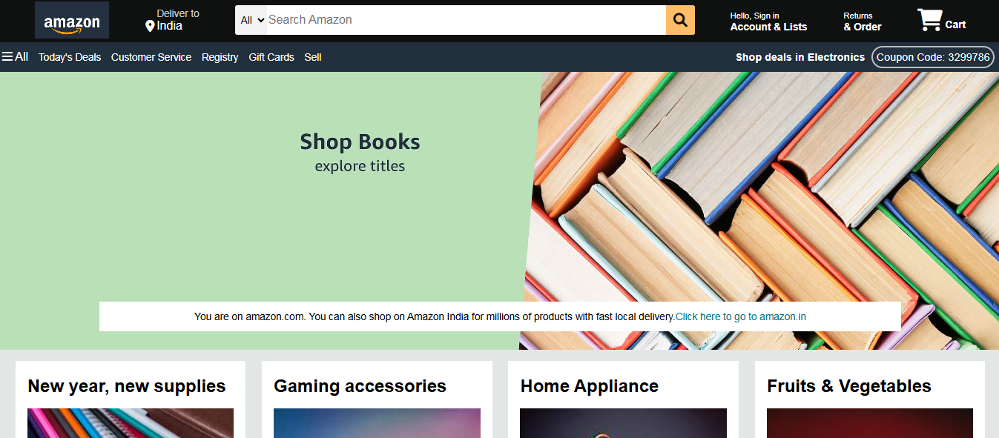

# 🛒 Amazon Clone

This is a **responsive Amazon Clone** built using **HTML**, **CSS**, and **Bootstrap**.  
The project replicates the look and feel of Amazon's homepage and demonstrates strong frontend development skills using only core web technologies without JavaScript frameworks.

---

## 📸 Preview

 <!-- Replace with actual screenshot path if available -->

---

## 💡 Features

- 🧱 Layout similar to Amazon homepage
- 📱 Fully responsive using **Bootstrap**
- 🎨 Clean and structured UI using custom **CSS**
- 🔤 Fonts and icons from **Font Awesome**
- 📦 Product grid and header/footer cloning

---

## 🛠️ Technologies Used

- HTML5  
- CSS3  
- Bootstrap 5  

---